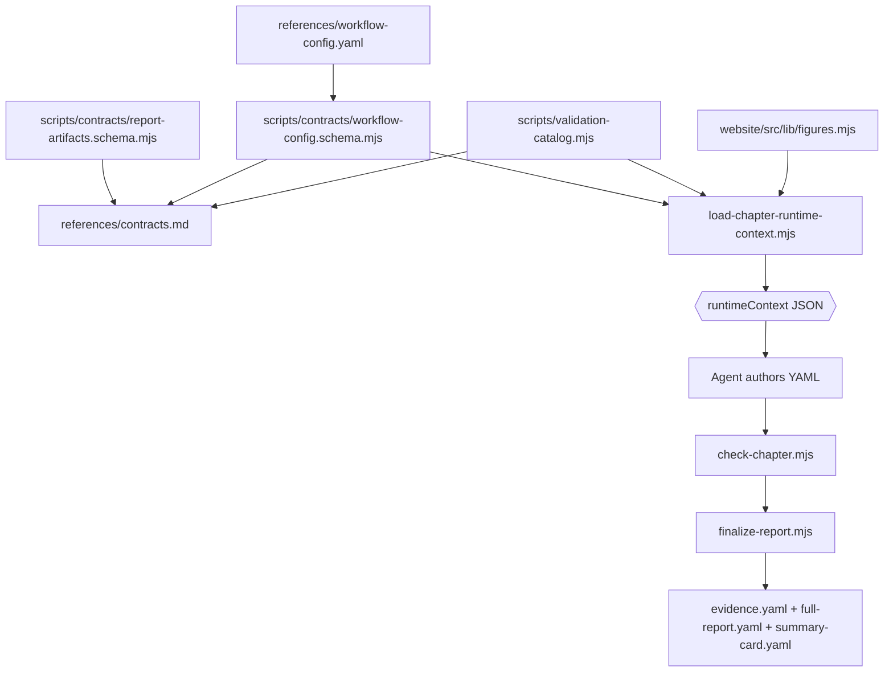

# startup-research contracts

This directory contains data and generated references for the `startup-research` workflow.

## Source-of-truth model

- `workflow-config.yaml` is the editable workflow data: inputs, named conditions, phases, agent policy, gates, report-level policies, and chapter plans.
- `contracts.md` is generated agent-readable documentation. Do not edit it by hand; run `npm run build:contracts` after changing executable schemas or catalogs.
- Executable schemas live in `../scripts/contracts/`:
  - `workflow-config.schema.mjs` validates and normalizes `workflow-config.yaml`.
  - `report-artifacts.schema.mjs` validates report artifact shape and report-meta shape.
  - `runtime-context.schema.mjs` validates the runtime-context envelope.
- Vocabularies, retry dimensions, precedence, and default fix hints live in `../scripts/validation-catalog.mjs`.
- Figure renderer contracts live in `website/src/lib/figures.mjs` and are projected into runtime contexts.

## Runtime flow

## Change routing

| Change | Edit | Verify |
|---|---|---|
| Inputs, workflow phases, chapter plan, gates, or policy strings | `workflow-config.yaml` | `npm run check:workflow-config` |
| Workflow config fields/semantics | `../scripts/contracts/workflow-config.schema.mjs`, then regenerate docs | `npm run build:contracts && npm run check:workflow-config` |
| Report artifact fields or report-meta shape | `../scripts/contracts/report-artifacts.schema.mjs`, validators/renderers as needed, then regenerate docs | `npm run build:contracts && npm run check:reports-contract` |
| Runtime-context envelope | `../scripts/contracts/runtime-context.schema.mjs` and `load-chapter-runtime-context.mjs`, then regenerate docs | loader JSON plus `npm run validate` |
| Vocabularies, retry dimensions, or fix hints | `../scripts/validation-catalog.mjs`, then regenerate docs | `npm run build:contracts && npm run validate` |
| Figure renderer contracts | `website/src/lib/figures.mjs` and schema/checker consumers | `npm run validate` |
| Skill process wording | `../SKILL.md` only; keep it as a thin workflow entry point | targeted command plus `npm run validate` when behavior changes |

## Generated-file rule

`contracts.md` replaces the old hand-maintained schema prose files. If it is stale, update the executable source and regenerate; do not patch the generated Markdown directly.
