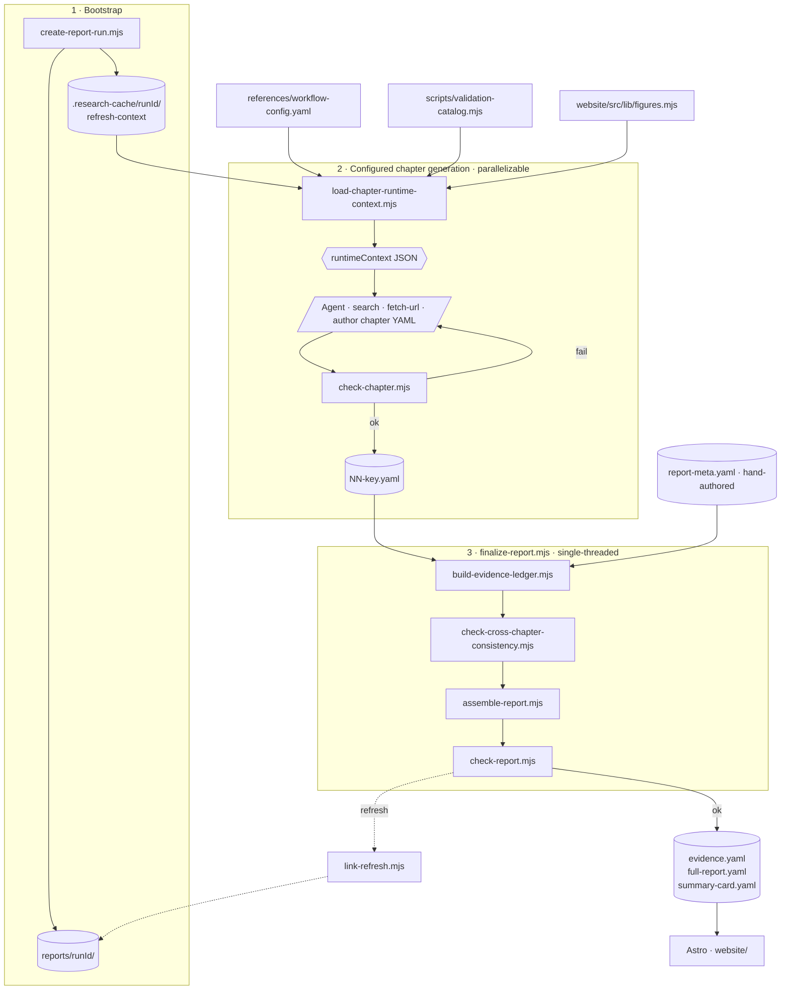

# startup-research responsibility model

This skill has two authority layers:

- **Runtime authority for the report-writing agent:** the chapter runtime context emitted by `scripts/load-chapter-runtime-context.mjs`. Agents should author from `runtimeContext.workflow`, `runtimeContext.chapter`, `runtimeContext.vocabularies`, `runtimeContext.checkDimensions`, and `runtimeContext.rendererContracts`, not from memorized prose.
- **Maintenance authority for developers:** the source files listed below. If runtime-context output and source intent disagree, fix the source or loader; do not add another copy of the rule in prose.

The governing rule is: one fact or rule gets one owner. Other files may point to it, summarize its purpose, or expose a generated view, but they should not maintain a second copy.

The three main contracts are layered, not peer schemas:

- `workflow-config.yaml` + `workflow-config-schema-v1.md` own the authoring plan: what to write and what gates to clear.
- `report-schema-v2.md` owns artifact shapes: what files under `reports/<runId>/` look like.
- `chapter-runtime-context-schema-v2.md` owns the runtime projection: what `load-chapter-runtime-context.mjs` gives the agent and where every projected block comes from.

## Runtime flow

Stage notes:

- **Bootstrap.** `create-report-run.mjs` allocates the run id, writes the report folder, and (for refresh runs) seeds `.research-cache/runId/` with `refresh-context.yaml`.
- **Configured chapter generation.** `load-chapter-runtime-context.mjs` merges `workflow-config.yaml` (via `utils.mjs`), `validation-catalog.mjs` vocabularies/dimensions, `figures.mjs` renderer contracts, and run-cache hints into the runtime context the agent reads. Each configured chapter is independent (own ID-letter namespace), so chapters can be drafted in parallel; `check-chapter` still compares `gate.minNetNewSources` against earlier-order configured chapters and scans other on-disk chapters for `crossChapterRefLeak`, so all checks must run after every chapter YAML lands.
- **Finalize.** `finalize-report.mjs` runs the consolidation and gate scripts in order; first failure stops the pipeline. `link-refresh.mjs` writes the revision graph for `--refresh` runs.
- **Render.** The Astro site reads `reports/runId/` and renders the static pages.

## Ownership map

| Owner | Owns | Does **not** own |
|---|---|---|
| `SKILL.md` | Process entry point: inputs, command sequence, chapter generation, retry flow, finalization flow | Field definitions, enum values, gates, file allowlists, checker algorithms, renderer contracts |
| `references/workflow-config.yaml` | Workflow policy, `agentPolicy`, chapter order, chapter missions, requirements, planned tables/figures, per-chapter gates, report-level gate settings | Validator algorithms, enum catalogs, renderer data contracts, CLI behavior |
| `references/workflow-config-schema-v1.md` | Field semantics for `workflow-config.yaml`, including `agentPolicy`, chapter briefs, planned tables/figures, and gate settings | Report artifact shapes, checker algorithms, renderer data contracts |
| `scripts/utils.mjs` | Config loading/normalization, derived workflow values, shared paths, shared final artifact filename constants | Human-facing workflow prose, checker-specific rules beyond normalization |
| `scripts/load-chapter-runtime-context.mjs` | Runtime-context composition and `contractSources`: the agent-facing runtime projection of config, vocabularies, dimensions, renderer contracts, run cache, and context | Original ownership of the config, vocabularies, checker logic, or renderer logic it exposes |
| `references/chapter-runtime-context-schema-v2.md` | Runtime-context envelope, projection fields, provenance, context summary shapes, and intentionally absent runtime data | Workflow config field semantics, report artifact shapes, enum values, checker algorithms |
| `references/report-schema-v2.md` | YAML artifact field shapes, ID conventions, reusable artifact object shapes, run-cache file shapes | CLI process, checker internals, workflow policy, renderer data contracts |
| `references/yaml-rules.md` | YAML syntax constraints: indentation, quoting, anchors, numeric/null rules | Report field semantics, process, validators |
| `scripts/validation-catalog.mjs` | Canonical vocabularies, retry dimensions, precedence, default fixes, shared validation catalogs | Chapter order, report workflow prose, renderer implementation |
| `check-chapter.mjs`, `check-cross-chapter-consistency.mjs`, `check-report.mjs` | Executable validation and failure reporting | Documentation-only policy or alternate rule copies |
| `build-evidence-ledger.mjs`, `assemble-report.mjs`, `finalize-report.mjs`, `link-refresh.mjs` | Consolidation, assembly, final report generation, refresh revision linking | Chapter authoring policy and report schema definitions |
| `website/src/lib/figures.mjs` | Figure types, figure layouts, figure data-field contracts used by the renderer and surfaced to runtime contexts | Chapter workflow policy or report-generation process |
| `reports/<runId>/` | Generated report artifacts and hand-authored `report-meta.yaml` for a run | Source-of-truth workflow configuration or reusable policy |
| `.research-cache/<runId>/` | Scratch runtime contexts, fetches, disclosure hints, refresh context, and historical run context | Canonical workflow state or generated report outputs |

## Change routing

| If you need to change... | Edit | Then verify |
|---|---|---|
| Chapter order, chapter file names, gates, missions, planned tables/figures, or agent-facing policy strings | `references/workflow-config.yaml`; update `references/workflow-config-schema-v1.md` only when field semantics change | `npm run check:workflow-config`; usually `npm run validate` |
| Runtime-context fields or composition | `scripts/load-chapter-runtime-context.mjs` and `references/chapter-runtime-context-schema-v2.md` | Loader JSON output plus `npm run validate` |
| Allowed report-folder files | The source owners: chapter files from `workflow-config.yaml`, generated artifacts from `utils.FINAL_ARTIFACTS`, hand-authored files from `utils.REPORT_META_FILE` | Loader JSON output and `npm run validate` |
| Vocabularies, retry dimensions, or default checker fixes | `scripts/validation-catalog.mjs` | `load-chapter-runtime-context.mjs --list --format json` plus `npm run validate` |
| Figure type contracts | `website/src/lib/figures.mjs` and any validator/renderer code that consumes it | `npm run validate` |
| YAML artifact field shapes | `references/report-schema-v2.md` plus validators/loaders/renderers that enforce the shape | `npm run check:reports-contract` or `npm run validate` |
| CLI flags or command behavior | The relevant `scripts/*.mjs` and its `--help`; update `SKILL.md` only when the workflow changes | Targeted command plus `npm run validate` when behavior affects reports |
| Website rendering or browsing UI | `website/` | `npm --prefix website run build` or `npm run validate` |

## Documentation responsibility

Rules for the documentation files inside this skill (`SKILL.md`, files in `references/`, and the `--help` / source modules under `scripts/`). Each file answers exactly one question; other files referencing the same topic degrade to a one-line pointer.

| File | Owns | Does **not** own |
|---|---|---|
| `SKILL.md` | Process: steps, CLI, decisions, retry policy, research/evidence rules | Field definitions, enum values, checker algorithms |
| `references/<topic>-schema-v<N>.md` | Schema: field shapes, IDs, cross-schema pointers | CLI, process advice, checker internals, enum catalogs owned by source modules |
| `references/yaml-rules.md` | YAML syntax constraints (indentation, quoting, anchors, numeric/null) | Schema, process |
| `references/<config>.yaml` | Configuration data (e.g. `workflow-config.yaml`) | Executable algorithms, duplicated generated runtime-context summaries |
| `scripts/<name>.mjs --help` | CLI usage: arguments, mutual-exclusion rules | Field semantics, process |
| Source modules (e.g. `scripts/validation-catalog.mjs`) | Vocab values and checker algorithms (runtime source of truth) | Documentation duplication |

**Total rule.** Schema docs describe "what this field is in the data". Anything about what command produced it, what the checker does with it, or what another schema looks like degrades to a one-line pointer to the file that owns it. Cross-schema pointers are one-directional: schema -> schema is allowed; schema -> `SKILL.md` is not; process docs read schemas, schemas do not loop back to describe process.

**Common violations to watch for in schema docs:**

- Inline CLI flags or invocation commands (belongs in `SKILL.md` or `--help`).
- "The agent should ..." / "Use this to ..." advice (belongs in `SKILL.md`).
- Re-listing enum values whose source of truth is a `.mjs` module.
- Inlining another schema's fields when a `see references/<other>.md` pointer would do.
- Field comments that describe checker algorithms instead of field semantics.
