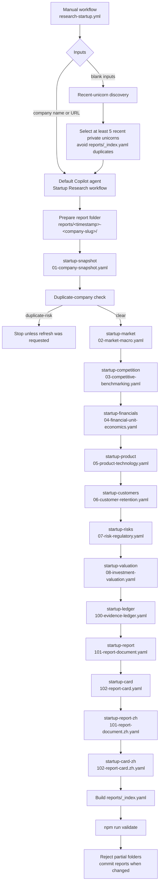

# Startup

Startup generates evidence-backed diligence reports for named startup companies. The default Copilot agent follows `AGENTS.md`, calls workspace skills, writes structured YAML artifacts, and an Astro static site renders the reports.

## What it does

- Researches a user-provided startup company or official URL.
- Produces evidence-backed report artifacts under `reports/`.
- Renders reports as a fast static Astro website.
- Generates required English and Simplified Chinese YAML reports.
- Includes search, filters, scorecards, market sizing, financial scenarios, and risk visuals.

## Report artifact flow



```text
Startup Research workflow (default agent + skills)
  ├─ startup-snapshot              → 01-company-snapshot.yaml with localEvidence
  ├─ startup-market                → 02-market-macro.yaml
  ├─ startup-competition           → 03-competitive-benchmarking.yaml
  ├─ startup-financials            → 04-financial-unit-economics.yaml
  ├─ startup-product               → 05-product-technology.yaml
  ├─ startup-customers             → 06-customer-retention.yaml
  ├─ startup-risks                 → 07-risk-regulatory.yaml
  ├─ startup-valuation             → 08-investment-valuation.yaml
  ├─ startup-ledger                → 100-evidence-ledger.yaml
  ├─ startup-report                → 101-report-document.yaml
  ├─ startup-card                  → 102-report-card.yaml
  ├─ startup-report-zh             → 101-report-document.zh.yaml
  └─ startup-card-zh               → 102-report-card.zh.yaml
```

## Local development

From the repo root:

```bash
npm install
npm --prefix website install
npm run validate
```

From `website/`:

```bash
npm run dev
npm run build
npm run preview
```

## Generate a report

Ask the default Copilot agent to run the Startup Research workflow with a company name and optional URL, for example:

> Research Perplexity AI — official site https://www.perplexity.ai — with Chinese translation.

The report should be written to `reports/<timestamp>-<company-slug>/` and will appear on the website after validation/build.

## Core files

- `reports/` — generated report folders and `_index.yaml` catalog.
- `AGENTS.md` — default-agent workflow contract.
- `.github/skills/` — stage skills used by the workflow.
- `.github/schemas/startup-diligence-report-v2.md` — canonical YAML schema and rendering contract.
- `.github/references/` — shared YAML syntax and evidence-ledger rules.
- `scripts/build-reports-index.mjs` — rebuilds `reports/_index.yaml`.
- `scripts/check-company-dedup.mjs` — fails with duplicate-risk details for matching company names or domains.
- `scripts/consolidate-evidence.mjs` — dedupes per-artifact `localEvidence` into final `100-evidence-ledger.yaml`.
- `scripts/check-reports-content.mjs` — evidence coverage, source diversity, and EN↔ZH parity checks.
- `website/src/content/reports-loader.ts` — Astro content loader for report YAML.
- `website/scripts/check-reports.mjs` — rendering-contract validator (schema heads, figure types, enums, refs).
