# Startup

Startup is an agent-driven research website for detailed reports on named startup companies. A single `Startup Research` agent uses workspace skills to produce structured YAML artifacts, validation scripts verify them, and an Astro static site renders the reports.

## What it does

- Researches a user-provided startup company or official URL.
- Produces evidence-backed report artifacts under `reports/`.
- Renders reports as a fast static Astro website.
- Generates required English and Simplified Chinese YAML reports.
- Includes search, filters, scorecards, market sizing, financial scenarios, and risk visuals.

## Report artifact flow

```mermaid
flowchart TD
  A[Manual GitHub workflow<br/>research-startup.yml] --> B{Inputs}
  B -->|company name or URL| C[Startup Research agent<br/>single-company mode]
  B -->|no company input| D[Default Copilot orchestrator<br/>recent-unicorn discovery]
  D --> E[Select at least 5 recent private unicorns<br/>avoid existing reports/_index.yaml duplicates]
  E --> F[Launch one Startup Research agent<br/>per selected company]
  F --> C

  C --> G[Prepare report folder<br/>reports/&lt;timestamp&gt;-&lt;company-slug&gt;/]
  G --> H[startup-brief skill<br/>research plan]
  H --> H1[00-report-brief.yaml]
  H1 --> X[startup-company-snapshot skill<br/>ledger + snapshot]
  X --> X1[01-evidence-ledger.yaml<br/>02-company-snapshot.yaml]
  X1 --> I[Post-02 duplicate-company check<br/>scripts/check-company-dedup.mjs]
  I -->|duplicate-risk| I1[Stop unless user requested refresh]
  I -->|clear| J[startup-market skill<br/>dynamic web_search if needed]
  J --> J1[03-market-macro.yaml]
  J1 --> K[startup-competition skill<br/>dynamic web_search if needed]
  K --> K1[04-competitive-benchmarking.yaml]
  K1 --> L[startup-financials skill<br/>dynamic web_search if needed]
  L --> L1[05-financial-unit-economics.yaml]
  L1 --> N[startup-product-technology skill<br/>dynamic web_search if needed]
  N --> N1[06-product-technology.yaml]
  N1 --> O[startup-customer-retention skill<br/>dynamic web_search if needed]
  O --> O1[07-customer-retention.yaml]
  O1 --> P[startup-risk-regulatory skill<br/>dynamic web_search if needed]
  P --> P1[08-risk-regulatory.yaml]
  P1 --> V[startup-investment-valuation skill<br/>dynamic web_search if needed]
  V --> V1[09-investment-valuation.yaml]
  V1 --> M[startup-report-writer skill]
  M --> M1[10-report-document.yaml<br/>11-report-card.yaml]
  M1 --> Q[startup-report-zh skill]
  Q --> Q1[10-report-document.zh.yaml<br/>11-report-card.zh.yaml]
  Q1 --> R[Build reports/_index.yaml]
  R --> S[npm run validate<br/>content checks, rendering contract, Astro build]
  S --> T[Reject partial folders<br/>commit reports when changed]
```



```text
Startup Research single agent
  ├─ startup-brief                 → 00-report-brief.yaml
  ├─ startup-company-snapshot      → 01-evidence-ledger.yaml, 02-company-snapshot.yaml
  ├─ startup-market                → 03-market-macro.yaml
  ├─ startup-competition           → 04-competitive-benchmarking.yaml
  ├─ startup-financials            → 05-financial-unit-economics.yaml
  ├─ startup-product-technology    → 06-product-technology.yaml
  ├─ startup-customer-retention    → 07-customer-retention.yaml
  ├─ startup-risk-regulatory       → 08-risk-regulatory.yaml
  ├─ startup-investment-valuation  → 09-investment-valuation.yaml
  ├─ startup-report-writer         → 10-report-document.yaml, 11-report-card.yaml
  └─ startup-report-zh             → 10-report-document.zh.yaml, 11-report-card.zh.yaml
```

## Local development

From the repo root:

```bash
npm install
npm --prefix website install
npm run validate
```

From `website/`:

```bash
npm run dev
npm run build
npm run preview
```

## Generate a report

Invoke the `Startup Research` agent with a named startup and optional URL, for example:

> Research Perplexity AI — official site https://www.perplexity.ai — with Chinese translation.

The report should be written to `reports/<timestamp>-<company-slug>/` and will appear on the website after validation/build.

## Core files

- `reports/` — generated report folders and `_index.yaml` catalog.
- `.github/agents/research.agent.md` — single report-generation agent.
- `.github/skills/` — stage skills used by the `Startup Research` agent.
- `.github/schemas/startup-diligence-report-v2.md` — canonical YAML schema and rendering contract.
- `.github/references/` — shared YAML syntax and evidence-ledger rules.
- `scripts/build-reports-index.mjs` — rebuilds `reports/_index.yaml`.
- `scripts/check-company-dedup.mjs` — fails with duplicate-risk details for matching company names or domains.
- `scripts/check-reports-content.mjs` — evidence coverage, source diversity, and EN↔ZH parity checks.
- `website/src/content/reports-loader.ts` — Astro content loader for report YAML.
- `website/scripts/check-reports.mjs` — rendering-contract validator (schema heads, figure types, enums, refs).
