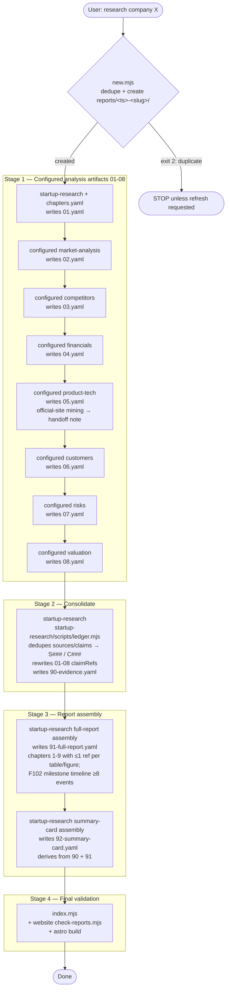
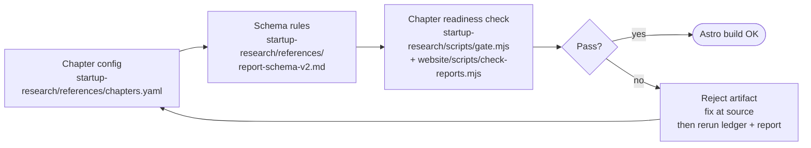

# Startup

Startup generates evidence-backed diligence reports for named startup companies. The default Copilot agent follows `AGENTS.md`, calls workspace skills, writes structured YAML artifacts, and an Astro static site renders the reports.

## What it does

- Researches a user-provided startup company or official URL.
- Produces evidence-backed report artifacts under `reports/`.
- Renders reports as a fast static Astro website.
- Generates required English YAML reports.
- Includes search, filters, scorecards, market sizing, financial scenarios, and risk visuals.

## Report artifact flow

`startup-research` is the single workflow skill. It reads `.github/skills/startup-research/references/chapters.yaml`, runs each configured analysis chapter through the shared research/evidence/gate loop, then serially builds `90-evidence.yaml`, `91-full-report.yaml`, and `92-summary-card.yaml`.



### Per-chapter dynamic gap loop

Every configured analysis chapter closes its own supportable gaps before writing. Volatile facts (funding, valuation, customer counts, releases, lawsuits) are anchored to `currentDate` and audited for freshness; if a query returns thin or stale results the workflow rewrites the question from another angle before declaring a gap.


### Three-layer defence

Every artifact is constrained by chapter config, central schema rules, and build-time lints. Failures are rejected at build and pushed back to the source artifact rather than patched in `91`.



Lint coverage today:

- render-critical structure is checked at build time; business vocabulary such as recommendations, risk ratings, callout labels, and evidence labels is governed by `.github/skills/startup-research/references/report-schema-v2.md` plus chapter review rather than build-time enum checks.
- every table row has exactly `columns.length` cells.
- `matrix` / `heatmap` figures: each `row.values.length === data.columns.length` (row label lives in `row.label`, not in `columns[]`).
- each `tableRef` / `figureRef` is referenced from at most one chapter section or appendix block.
- F102 company milestone timeline must have ≥8 events covering founding, every priced round, major launches, scale milestones, partnerships, and governance/legal events.
- card `tableCount` / `figureCount` / `overallScore` match `91-full-report.yaml`.

### Required artifacts

```text
reports/<timestamp>-<slug>/
  ├─ 01-company-overview.yaml
  ├─ 02-market-analysis.yaml
  ├─ 03-competitors.yaml
  ├─ 04-financials.yaml
  ├─ 05-product-tech.yaml
  ├─ 06-customers.yaml
  ├─ 07-risks.yaml
  ├─ 08-valuation.yaml
  ├─ 90-evidence.yaml
  ├─ 91-full-report.yaml
  └─ 92-summary-card.yaml
```

## Local development

From the repo root:

```bash
npm install
npm --prefix website install
npm run validate
```

From `website/`:

```bash
npm run dev
npm run build
npm run preview
```

## Generate a report

Ask the default Copilot agent to run the Startup Research workflow with a company name and optional URL, for example:

> Research Perplexity AI — official site https://www.perplexity.ai.

The report should be written to `reports/<timestamp>-<company-slug>/` and will appear on the website after validation/build.

## Core files

- `reports/` — generated report folders and `_index.yaml` catalog.
- `AGENTS.md` — repo-wide agent operating rules; the full report workflow lives in `.github/skills/startup-research/SKILL.md`.
- `.github/skills/startup-research/` — the single startup report workflow skill.
- `.github/skills/startup-research/references/chapters.yaml` — canonical chapter and artifact configuration.
- `.github/skills/startup-research/references/report-schema-v2.md` — canonical YAML schema and rendering contract.
- `.github/skills/startup-research/references/` — private YAML syntax, chapter config, and schema references for the workflow skill.
- `.github/skills/startup-research/scripts/index.mjs` — rebuilds `reports/_index.yaml`.
- `.github/skills/startup-research/scripts/new.mjs` — duplicate-risk check plus report folder creation.
- `.github/skills/startup-research/scripts/ledger.mjs` — dedupes per-artifact `localEvidence` into final `90-evidence.yaml`.
- `.github/skills/startup-research/scripts/gate.mjs` — chapter-scoped evidence, depth, table, and figure readiness check for `01`–`08` artifacts.
- `website/src/content/reports-loader.ts` — Astro content loader for report YAML.
- `website/scripts/check-reports.mjs` — rendering-contract validator (schema heads, figure contracts, refs, and card/report consistency).
