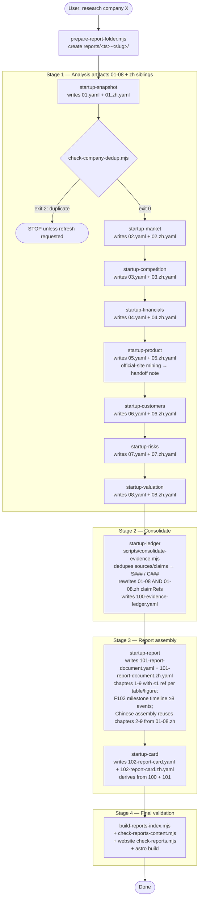
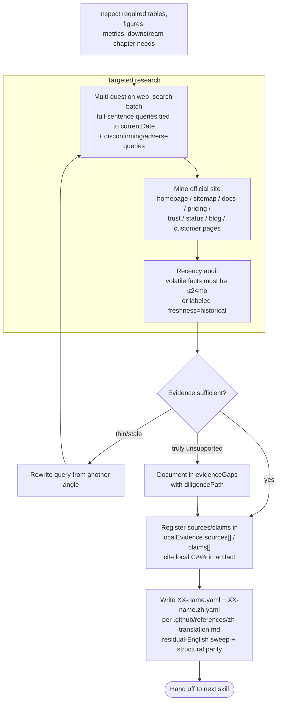
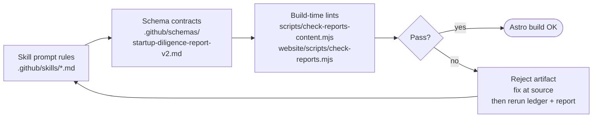

# Startup

Startup generates evidence-backed diligence reports for named startup companies. The default Copilot agent follows `AGENTS.md`, calls workspace skills, writes structured YAML artifacts, and an Astro static site renders the reports.

## What it does

- Researches a user-provided startup company or official URL.
- Produces evidence-backed report artifacts under `reports/`.
- Renders reports as a fast static Astro website.
- Generates required English and Simplified Chinese YAML reports.
- Includes search, filters, scorecards, market sizing, financial scenarios, and risk visuals.

## Report artifact flow

Each analysis skill writes both the English artifact and its Simplified Chinese sibling in the same pass. After all 8 analysis pairs exist, `startup-ledger` consolidates evidence, then `startup-report` synthesizes both `101-report-document.yaml` and `101-report-document.zh.yaml` (English assembly + Chinese assembly in one stage by reusing already-translated content from `01–08.zh.yaml`), and finally `startup-card` produces both `102-report-card.yaml` and `102-report-card.zh.yaml` in the same way.



### Per-skill dynamic gap loop

Every analysis skill closes its own supportable gaps before writing. Volatile facts (funding, valuation, customer counts, releases, lawsuits) are anchored to `currentDate` and audited for freshness; if a query returns thin or stale results the skill rewrites the question from another angle before declaring a gap.



### Three-layer defence

Every artifact is constrained by skill prompts, central schema contracts, and build-time lints. Failures are rejected at build and pushed back to the source artifact rather than patched in `101`.



Lint coverage today:

- enum fields restricted to schema-defined values (`recommendation`, `confidence`, `riskRating`, `valuationStance`, `claimType`, `freshness`, `corroboration`, `sourceType`, `reputationTier`, `independence`).
- every table row has exactly `columns.length` cells.
- `matrix` / `heatmap` figures: each `row.values.length === data.columns.length` (row label lives in `row.label`, not in `columns[]`).
- each `tableRef` / `figureRef` is referenced from at most one chapter section or appendix block.
- F102 company milestone timeline must have ≥8 events covering founding, every priced round, major launches, scale milestones, partnerships, and governance/legal events.
- 8 `XX-name.zh.yaml` siblings exist with byte-identical IDs / table IDs / figure IDs / `runDate` / `slug` to their English source.
- card `tableCount` / `figureCount` / `overallScore` match `101-report-document.yaml`.

### Required artifacts

```text
reports/<timestamp>-<slug>/
  ├─ 01-company-snapshot.yaml      ↔ 01-company-snapshot.zh.yaml
  ├─ 02-market-macro.yaml          ↔ 02-market-macro.zh.yaml
  ├─ 03-competitive-benchmarking.yaml      ↔ 03-...zh.yaml
  ├─ 04-financial-unit-economics.yaml      ↔ 04-...zh.yaml
  ├─ 05-product-technology.yaml            ↔ 05-...zh.yaml
  ├─ 06-customer-retention.yaml            ↔ 06-...zh.yaml
  ├─ 07-risk-regulatory.yaml               ↔ 07-...zh.yaml
  ├─ 08-investment-valuation.yaml          ↔ 08-...zh.yaml
  ├─ 100-evidence-ledger.yaml      (no zh sibling — citations rendered from sources[])
  ├─ 101-report-document.yaml      ↔ 101-report-document.zh.yaml
  └─ 102-report-card.yaml          ↔ 102-report-card.zh.yaml
```

## Local development

From the repo root:

```bash
npm install
npm --prefix website install
npm run validate
```

From `website/`:

```bash
npm run dev
npm run build
npm run preview
```

## Generate a report

Ask the default Copilot agent to run the Startup Research workflow with a company name and optional URL, for example:

> Research Perplexity AI — official site https://www.perplexity.ai — with Chinese translation.

The report should be written to `reports/<timestamp>-<company-slug>/` and will appear on the website after validation/build.

## Core files

- `reports/` — generated report folders and `_index.yaml` catalog.
- `AGENTS.md` — default-agent workflow contract.
- `.github/skills/` — stage skills used by the workflow.
- `.github/schemas/startup-diligence-report-v2.md` — canonical YAML schema and rendering contract.
- `.github/references/` — shared YAML syntax and evidence-ledger rules.
- `scripts/build-reports-index.mjs` — rebuilds `reports/_index.yaml`.
- `scripts/check-company-dedup.mjs` — fails with duplicate-risk details for matching company names or domains.
- `scripts/consolidate-evidence.mjs` — dedupes per-artifact `localEvidence` into final `100-evidence-ledger.yaml`.
- `scripts/check-reports-content.mjs` — evidence coverage, source diversity, and EN↔ZH parity checks.
- `website/src/content/reports-loader.ts` — Astro content loader for report YAML.
- `website/scripts/check-reports.mjs` — rendering-contract validator (schema heads, figure types, enums, refs).
