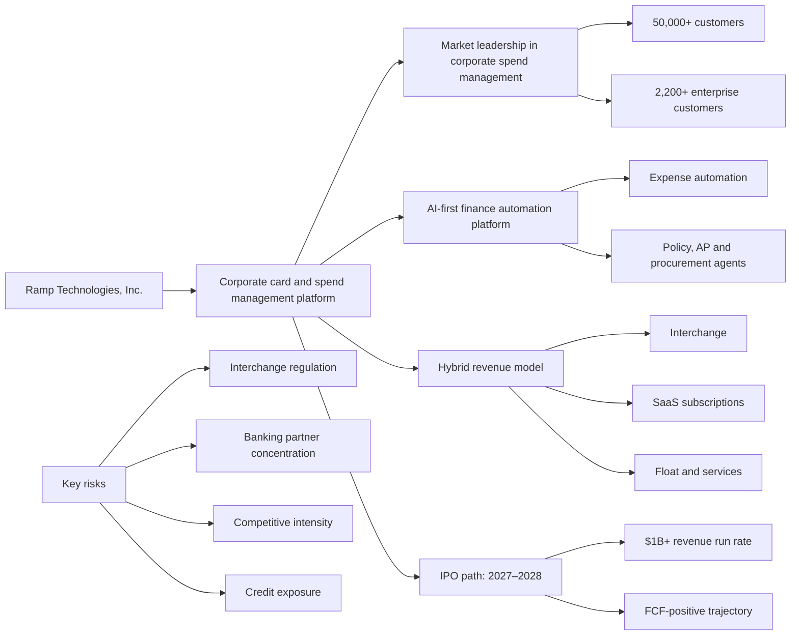
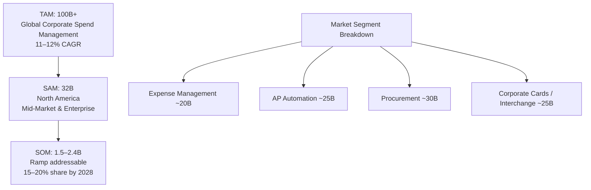
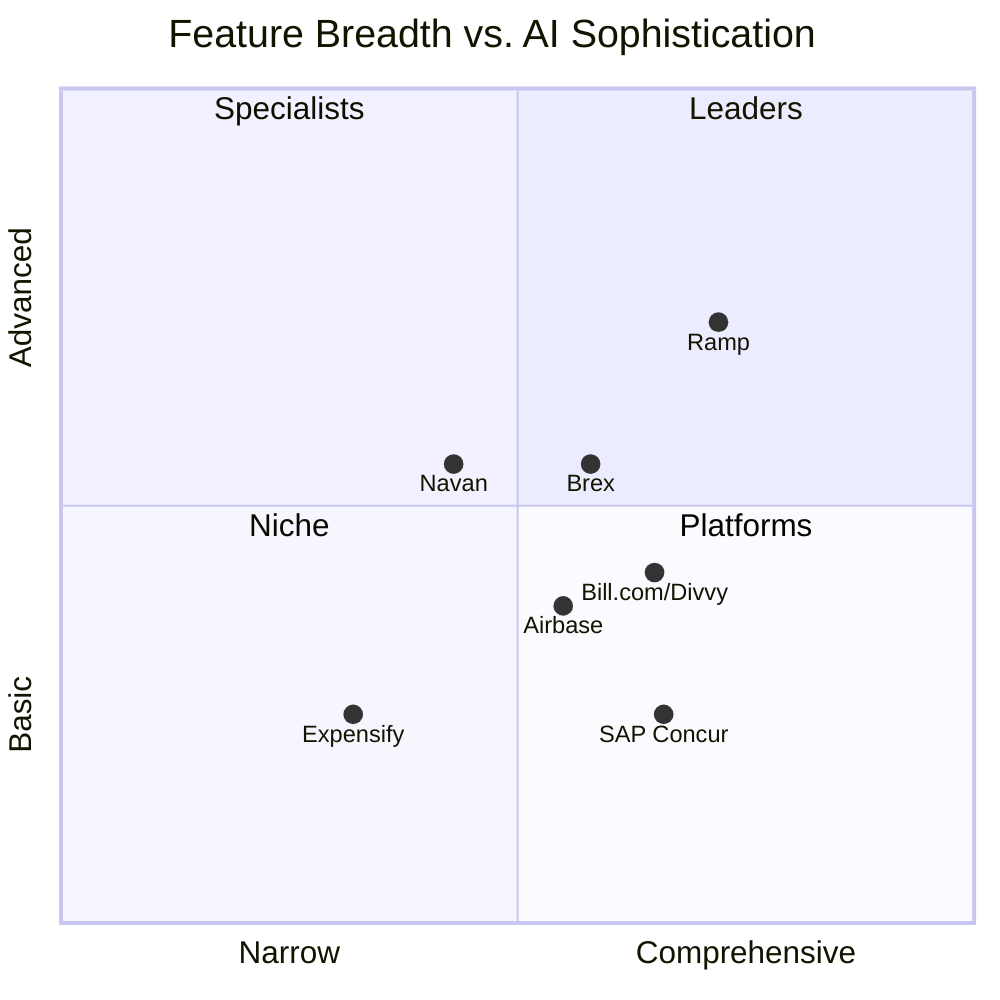
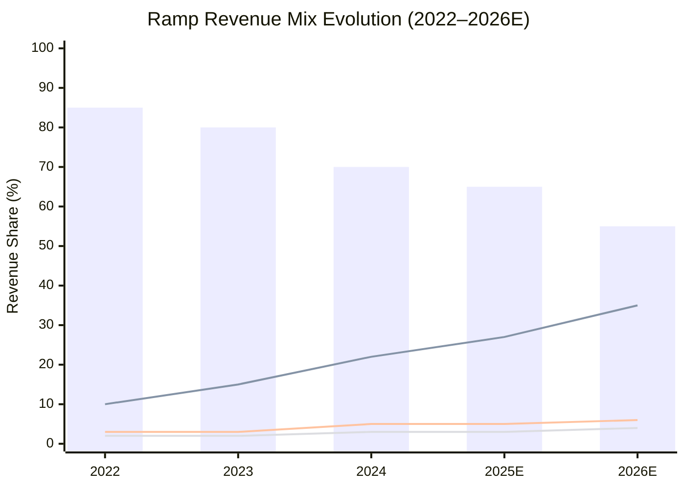
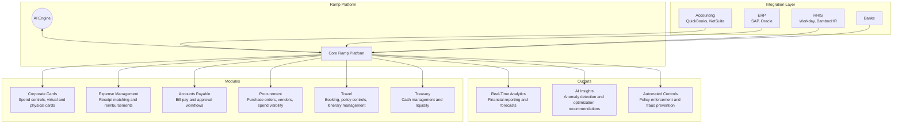
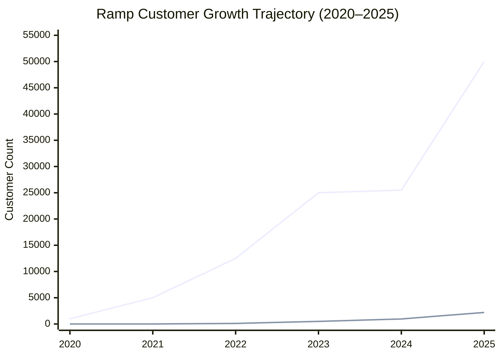
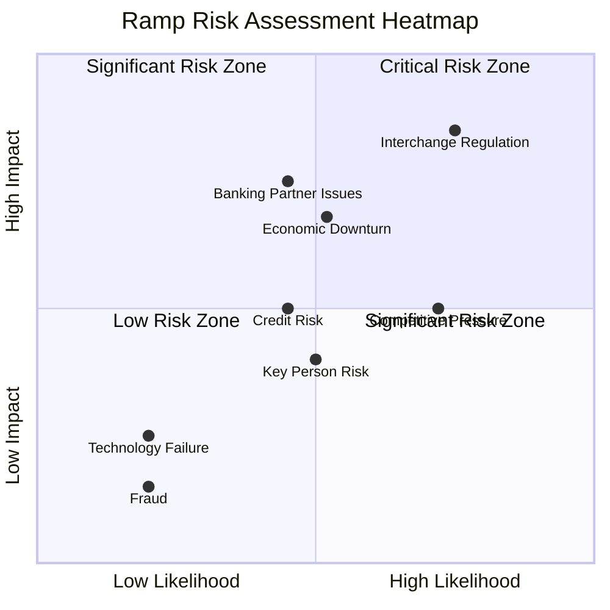

# VC Due Diligence Report: Ramp Technologies, Inc.

**Subtitle:** Corporate Card & Spend Management Platform  
**Prepared by:** K-Dense Web  
**Contact:** contact@k-dense.ai  
**Date:** January 27, 2026  
**Classification:** CONFIDENTIAL – Investment Committee Only  
**Generated using:** K-Dense Web (k-dense.ai)

## Cover Metrics

| Metric | Value |
|---|---:|
| Current valuation | $32 billion (November 2025) |
| Total funding | $2.3 billion |
| Annual revenue run rate | >$1 billion |
| Total payments volume | >$100 billion |

### Graphical Abstract: Investment Thesis Overview

## Contents

1. [Executive Summary](#1-executive-summary)
2. [Market Sizing & Macro Analysis](#2-market-sizing--macro-analysis)
3. [Competitive Benchmarking](#3-competitive-benchmarking)
4. [Financial & Unit Economics Analysis](#4-financial--unit-economics-analysis)
5. [Product & Technology Analysis](#5-product--technology-analysis)
6. [Customer Analysis & Retention](#6-customer-analysis--retention)
7. [Regulatory & Risk Assessment](#7-regulatory--risk-assessment)
8. [Investment Thesis & Valuation](#8-investment-thesis--valuation)
9. [Appendix A: Detailed Financial Model](#appendix-a-detailed-financial-model)
10. [Appendix B: Competitive Feature Deep Dive](#appendix-b-competitive-feature-deep-dive)
11. [Appendix C: Management Team](#appendix-c-management-team)
12. [Appendix D: Investor Base](#appendix-d-investor-base)
13. [Bibliography](#bibliography)
14. [Disclaimer](#disclaimer)

## List of Figures

- Figure 2.1: Corporate Spend Management TAM/SAM/SOM Analysis (2025–2030)
- Figure 3.1: Competitive Positioning Matrix: Feature Breadth vs. AI Sophistication
- Figure 4.1: Ramp Revenue Mix Evolution (2022–2026E)
- Figure 4.2: Ramp Unit Economics Waterfall: Customer Lifetime Value Build-Up
- Figure 5.1: Ramp Platform Architecture and Module Overview
- Figure 6.1: Ramp Customer Growth Trajectory (2020–2025)
- Figure 7.1: Ramp Risk Assessment Heatmap

## 1. Executive Summary

### 1.1 Investment Highlights

> **Investment Recommendation Summary**  
> **Recommendation:** STRONG BUY at current $32B valuation with 18–24 month hold period targeting IPO exit.  
> **Target Return:** 2.5–3.5x multiple on invested capital at IPO (projected 2027–2028).  
> **Risk Rating:** MODERATE – Primary concerns include interchange regulation, banking partner concentration, and competitive intensity.

Ramp Technologies, Inc. represents a compelling late-stage growth investment opportunity in the rapidly expanding corporate spend management market. Founded in 2019 by Eric Glyman and Karim Atiyeh, Ramp has achieved extraordinary growth, reaching a $32 billion valuation in November 2025—more than quadrupling from its $7.65 billion valuation in April 2024 (TechCrunch, 2025; Finovate, 2025).

#### 1.1.1 Key Investment Metrics

**Table 1.1: Ramp Key Performance Indicators (as of November 2025)**

| Metric | Value | YoY Growth | Benchmark |
|---|---:|---:|---|
| Valuation | $32B | +318% | Top 5 US fintech |
| Annualized Revenue | >$1B | +110–133% | Exceeds IPO threshold |
| Total Payments Volume | >$100B | +75% | Market leader |
| Customer Count | 50,000+ | +100% | Category leader |
| Enterprise Customers | 2,200+ | +133% | Strong upmarket motion |
| Net Revenue Retention | >130%* | N/A | Top decile SaaS |
| Total Funding Raised | $2.3B | N/A | Well-capitalized |

\*Estimated based on expansion patterns and industry benchmarks.

#### 1.1.2 Thesis Overview

The investment thesis rests on five core pillars:

1. **Market Leadership in High-Growth Category:** Ramp has captured an estimated 5–8% of the $20B+ corporate spend management TAM and is gaining share rapidly against both legacy players (SAP Concur, Expensify) and modern competitors (Brex, Bill.com/Divvy).
2. **Superior Product-Led Growth Engine:** AI-first platform architecture delivers demonstrable cost savings, driving organic adoption and low customer acquisition costs. The company claims to save customers an average of 5% on total spend.
3. **Durable Unit Economics:** Blended revenue model combining interchange fees (~70% of revenue), SaaS subscriptions (~25%), and services (~5%) provides multiple growth vectors with improving margin profile.
4. **Exceptional Management Team:** Experienced founders with deep fintech expertise, backed by top-tier investors including Founders Fund, Thrive Capital, Iconiq Growth, and General Catalyst.
5. **Clear Path to IPO:** Revenue scale ($1B+), profitability trajectory (free cash flow positive), and governance maturation position Ramp for a 2027–2028 public market debut.

#### 1.1.3 Key Risks

> **Risk Alert:** Primary risk factors include regulatory risk, banking partner concentration, competitive intensity, and credit risk exposure.

- **Regulatory Risk:** Proposed Durbin Amendment expansion and state-level interchange caps could compress 30–40% of gross margins.
- **Banking Partner Concentration:** Reliance on Celtic Bank and Sutton Bank for card issuance creates single points of failure.
- **Competitive Intensity:** Well-funded competitors (Brex: $12B valuation, Bill.com: $15B market cap) competing for the same customer base.
- **Credit Risk Exposure:** Charge card model exposes Ramp to default risk, particularly in economic downturn scenarios.

### 1.2 Valuation Summary

**Table 1.2: Valuation Analysis and Scenario Modeling**

| Scenario | 2027E Revenue | Multiple | Implied Valuation |
|---|---:|---:|---:|
| Bull Case | $3.5B | 15x | $52.5B |
| Base Case | $2.5B | 12x | $30.0B |
| Bear Case | $1.8B | 8x | $14.4B |

At the current $32B valuation with >$1B revenue run rate, Ramp trades at approximately 32x forward revenue—a premium to public SaaS comparables (median 8–12x) but justified by:

- Triple-digit revenue growth rates
- Path to free cash flow profitability
- Platform optionality (payments, procurement, treasury)
- Strategic acquirer interest (potential M&A premium)

## 2. Market Sizing & Macro Analysis

### 2.1 Total Addressable Market

The corporate spend management market represents one of the largest untapped opportunities in enterprise software, driven by the digitization of finance operations and the shift from manual to automated expense processes.

#### 2.1.1 Market Definitions

**Table 2.1: Market Segment Definitions and Sizing**

| Segment | Definition | 2025 Size |
|---|---|---:|
| Business Spend Management (BSM) | End-to-end procurement, invoicing, payments, and expense management | $10.5–26.4B |
| Expense Management Software | Receipt capture, reimbursement, policy enforcement | $7.6–8.3B |
| Corporate Card Issuance | Charge/credit cards for business expenses | $2T+ transaction volume |
| Accounts Payable Automation | Invoice processing and vendor payments | $3.1B |
| Procurement Software | Vendor management and purchasing | $8.2B |

#### 2.1.2 TAM/SAM/SOM Analysis

**Figure 2.1: Corporate Spend Management TAM/SAM/SOM Analysis (2025–2030)**

> **Key Insight:** Ramp’s addressable market extends beyond traditional expense management into procurement, AP automation, and treasury—representing a combined $50B+ TAM by 2030. The company’s integrated platform strategy positions it to capture wallet share across multiple budget categories.

**Total Addressable Market (TAM):** The global business spend management software market is valued at $10.5–26.4 billion in 2025, with projections reaching $40–50 billion by 2032 at an 11–12% CAGR (Data Insights Reports, 2025; SkyQuest, 2025). This represents the theoretical maximum market for all corporate spend solutions.

**Serviceable Addressable Market (SAM):** Focusing on North American mid-market and enterprise companies (Ramp’s core segments), the SAM narrows to approximately $8–12 billion. This includes:

- Expense management software: $3.2B (North America 2025)
- Corporate card transaction fees: $4.5B (interchange on $300B B2B card volume)
- AP automation: $1.8B
- Procurement platforms: $2.5B

**Serviceable Obtainable Market (SOM):** Based on current growth trajectory and competitive positioning, Ramp can realistically capture 15–20% of the North American SAM by 2028, representing $1.5–2.4B in annual revenue—implying continued 30–50% growth from current levels.

#### 2.1.3 Market Growth Drivers

**Table 2.2: Key Market Growth Drivers and Impact Assessment**

| Driver | Description | Impact | Timeline |
|---|---|---|---|
| Digital Transformation | CFOs prioritizing automation | High | Ongoing |
| Remote/Hybrid Work | Distributed spend requires controls | High | 2020–2026 |
| AI/ML Integration | Intelligent automation reduces FTE | Very High | 2024–2028 |
| Regulatory Compliance | SOX, ASC 842 requirements | Medium | Ongoing |
| SMB Software Adoption | Cloud-native tools reaching down-market | High | 2022–2027 |
| Bank Technology Modernization | Legacy system replacement | Medium | 2025–2030 |

### 2.2 Segment Analysis

#### 2.2.1 Enterprise Segment ($100K+ ARR)

The enterprise segment represents Ramp’s fastest-growing and highest-value cohort, with 2,200+ customers generating over $100K in annual revenue as of November 2025—a 133% year-over-year increase (Finovate, 2025).

Key characteristics:

- Average contract value: $250–500K
- Net revenue retention: >140% (estimated)
- Sales cycle: 60–120 days
- Key verticals: Technology, professional services, healthcare
- Notable customers: CBRE, Shopify, Anduril, Figma, Notion

#### 2.2.2 Mid-Market Segment ($25K–$100K ARR)

The mid-market segment (1,000–5,000 employees) represents Ramp’s core sweet spot, characterized by:

- Product-led acquisition with sales-assisted expansion
- Average deal size: $40–75K
- Fastest time-to-value (sub-30 day implementation)
- Highest platform utilization (multiple modules)

#### 2.2.3 SMB Segment (<$25K ARR)

The SMB segment provides volume and brand awareness but lower unit economics:

- Self-serve acquisition via free tier
- Average revenue per user: $3–8K
- Higher churn but serves as enterprise pipeline
- Geographic expansion opportunity

### 2.3 SMB Software Penetration Analysis

**Table 2.3: Expense Software Penetration by Company Size (2025)**

| Segment | Companies (US) | Penetration Rate | Growth Opportunity |
|---|---:|---:|---|
| Enterprise (5,000+ emp.) | 3,500 | 85% | Replacement |
| Mid-Market (500–5,000) | 35,000 | 55% | Greenfield + Replacement |
| SMB (50–500) | 650,000 | 25% | Greenfield |
| Micro (<50) | 6,000,000 | 8% | Nascent |

> **Key Insight:** The SMB and mid-market segments represent the largest growth opportunity, with combined penetration below 35%. Ramp’s product-led growth model and free tier are specifically designed to capture this underserved market.

## 3. Competitive Benchmarking

### 3.1 Competitive Overview

The corporate spend management market features intense competition across multiple vectors, including modern fintech challengers, legacy enterprise vendors, and adjacent platform players. Ramp has differentiated through an AI-first approach and aggressive pricing strategy.

**Figure 3.1: Competitive Positioning Matrix: Feature Breadth vs. AI Sophistication**

### 3.2 Primary Competitors

#### 3.2.1 Brex (Direct Competitor)

**Table 3.1: Brex Competitive Profile**

| Attribute | Details |
|---|---|
| Valuation | $12.3B (January 2022, down from $12.3B) |
| Funding | $1.5B total |
| Revenue | $500M+ ARR (2024 estimate) |
| Customers | 30,000+ |
| Founded | 2017 |
| Key Differentiator | Financial services suite (treasury, travel) |
| Target Market | Startups, tech companies |

Competitive dynamics:

- Brex pioneered the modern corporate card for startups but has struggled with profitability and strategic pivots (exiting SMB segment in 2022).
- Ramp has gained significant ground by maintaining SMB focus while expanding upmarket.
- Brex’s recent focus on “Brex AI” and enterprise solutions mirrors Ramp’s strategy but with less market traction.
- Keith Rabois (Founders Fund GP) sits on both Ramp and historically advised Brex, creating complex investor dynamics.

#### 3.2.2 Bill.com / Divvy

**Table 3.2: Bill.com/Divvy Competitive Profile**

| Attribute | Details |
|---|---|
| Market Cap | $15B (BILL, public) |
| Revenue | $1.3B (FY2025) |
| Customers | 400,000+ (Bill.com platform) |
| Divvy Acquisition | $2.5B (April 2021) |
| Key Differentiator | AP automation + card integration |
| Target Market | Accountants, SMBs |

Competitive dynamics:

- Bill.com’s Divvy acquisition created an integrated AP/expense platform.
- Strong accountant channel provides distribution advantage.
- Less focus on AI automation compared to Ramp.
- Public market pressures may limit investment capacity.

#### 3.2.3 Airbase

**Table 3.3: Airbase Competitive Profile**

| Attribute | Details |
|---|---|
| Valuation | $600M (Series C, 2022) |
| Funding | $107M total |
| Revenue | $30–50M ARR (estimate) |
| Key Differentiator | Procurement-first approach |
| Target Market | Mid-market finance teams |

Competitive dynamics:

- Airbase emphasizes procurement controls and approval workflows.
- Smaller scale limits competitive threat but serves as validation of category.
- Potential acquisition target for larger players.

#### 3.2.4 Navan (formerly TripActions)

**Table 3.4: Navan Competitive Profile**

| Attribute | Details |
|---|---|
| Valuation | $9.2B (2022) |
| Funding | $1.6B total |
| Revenue | $700M+ (2024 estimate) |
| Key Differentiator | Travel-first expense platform |
| Target Market | Travel-heavy enterprises |

Competitive dynamics:

- Navan’s travel management heritage provides differentiation.
- “Bring your own card” model creates data visibility gaps.
- Strong in travel-intensive verticals (consulting, professional services).
- Ramp’s travel booking launch (2025) directly threatens Navan’s positioning.

### 3.3 Legacy Competitors

#### 3.3.1 SAP Concur

**Table 3.5: SAP Concur Competitive Profile**

| Attribute | Details |
|---|---|
| Revenue | $1.7B (2024 estimate) |
| Customers | 67,000+ organizations |
| Market Share | ~40% of enterprise segment |
| Parent Company | SAP SE |
| Key Differentiator | ERP integration, global scale |
| Target Market | Large enterprises, multinationals |

Competitive dynamics:

- Concur remains the default choice for SAP-ecosystem enterprises.
- User experience widely criticized as “archaic” (4.0 G2 rating vs. Ramp’s 4.8).
- Pricing complexity creates opportunity for Ramp’s transparent model.
- Multi-year contracts create switching friction but also eventual displacement pipeline.

#### 3.3.2 Expensify

**Table 3.6: Expensify Competitive Profile**

| Attribute | Details |
|---|---|
| Market Cap | $350M (EXFY, public) |
| Revenue | $160M (2024) |
| Customers | 700,000+ individuals |
| Key Differentiator | Mobile-first, simple UX |
| Target Market | SMBs, individuals |

Competitive dynamics:

- Expensify pioneered mobile expense tracking but has lost momentum.
- Public company struggles (75%+ stock decline from IPO) limit investment.
- Free tier competition from Ramp directly threatens core market.
- Potential distressed acquisition target.

### 3.4 Competitive Matrix

**Table 3.7: Comprehensive Competitive Feature Matrix**

| Feature | Ramp | Brex | Divvy | Airbase | Navan | Concur | Expensify |
|---|---:|---:|---:|---:|---:|---:|---:|
| Corporate Cards | ✓ | ✓ | ✓ | ✓ | – | Partner | ✓ |
| Virtual Cards | ✓ | ✓ | ✓ | ✓ | – | – | ✓ |
| Expense Management | ✓ | ✓ | ✓ | ✓ | ✓ | ✓ | ✓ |
| AP Automation | ✓ | ✓ | ✓ | ✓ | ✓ | ✓ | – |
| Procurement | ✓ | – | – | ✓ | – | Partner | – |
| Travel Booking | ✓ | ✓ | – | – | ✓ | ✓ | – |
| Treasury | – | ✓ | – | – | – | – | – |
| AI Automation | ✓✓ | ✓ | – | – | ✓ | – | – |
| Free Tier | ✓ | – | ✓ | – | – | – | ✓ |
| Cashback | 1.5% | 1–8% | 1–7% | – | – | – | 1–2% |
| G2 Rating | 4.8 | 4.5 | 4.7 | 4.7 | 4.6 | 4.0 | 4.5 |

### 3.5 Competitive Advantages and Moats

> **Opportunity:** Ramp’s Durable Competitive Advantages

1. **AI-First Architecture:** Purpose-built ML models for expense categorization, fraud detection, and savings recommendations.
2. **Data Network Effects:** 50,000+ customers generate training data, improving automation accuracy.
3. **Product Velocity:** Weekly releases with 200+ features in 2025 alone.
4. **Pricing Moat:** Free tier and 1.5% cashback create switching costs.
5. **Integration Ecosystem:** 100+ native integrations with accounting/ERP systems.

## 4. Financial & Unit Economics Analysis

### 4.1 Revenue Model Overview

Ramp operates a hybrid revenue model combining payments-based economics with software subscription revenue, providing multiple growth vectors and improving margin profile over time.

**Figure 4.1: Ramp Revenue Mix Evolution (2022–2026E)**

#### 4.1.1 Revenue Components

**Table 4.1: Revenue Stream Analysis**

| Revenue Stream | Description | % Mix | Margin | Growth |
|---|---|---:|---:|---:|
| Interchange Fees | Card transaction revenue shared with issuing bank | 65–70% | 40–50% | +75% |
| Software Subscriptions | Ramp Plus and Enterprise plans | 20–25% | 80–90% | +150% |
| Float Income | Interest on customer deposits | 5–8% | 95% | +200% |
| Services | Implementation, consulting | 2–5% | 30–40% | +50% |

### 4.2 Interchange Economics Deep Dive

#### 4.2.1 Interchange Fee Structure

Interchange fees represent the largest revenue component, earned when Ramp cardholders make purchases. As a card issuer through banking partners (Celtic Bank, Sutton Bank), Ramp captures a portion of the merchant discount rate.

**Table 4.2: Interchange Fee Economics**

| Transaction Type | Avg. Interchange Rate | Ramp Share (Est.) |
|---|---:|---:|
| Corporate Credit (Signature) | 2.10% + $0.10 | 70–80% |
| Corporate Debit (Regulated) | 0.22% flat | 80–90% |
| Corporate Debit (Exempt) | 0.44% avg. | 80–90% |
| Virtual Card | 2.30% + $0.10 | 75–85% |
| International | 3.00%+ | 60–70% |

> **Key Insight:** Ramp benefits from Durbin Amendment exemptions through its partner banks (<$10B assets), earning approximately double the interchange rate of regulated issuers. This exemption represents a significant competitive advantage worth approximately $150–200M annually in incremental revenue.

#### 4.2.2 Interchange Revenue Calculation

With total payments volume exceeding $100B annually and growing, Ramp’s interchange revenue can be estimated as follows:

$$
\text{Interchange Revenue} = \text{TPV} \times \text{Avg. Rate} \times \text{Issuer Share}
$$

$$
= \$100B \times 1.80\% \times 75\% = \$1.35B \text{ gross interchange}
$$

$$
\approx \$650\text{–}700M \text{ net revenue after partner splits}
$$

### 4.3 Unit Economics Analysis

**Figure 4.2: Ramp Unit Economics Waterfall: Customer Lifetime Value Build-Up**

```mermaid
flowchart LR
  A["Gross Revenue per Customer\n$20,000"] --> B["Bank Partner Share\n-$3,000"]
  B --> C["Network Fees\n-$3,000"]
  C --> D["Net Revenue\n$14,000"]
  D --> E["COGS\n-$2,000"]
  E --> F["Gross Profit\n$12,000"]
  F --> G["S&M Allocation\n-$4,000"]
  G --> H["R&D Allocation\n-$5,000"]
  H --> I["G&A Allocation\n-$1,500"]
  I --> J["Contribution Margin\n$1,500"]

  J --> K["LTV Calculation\n$1,500 contribution margin × 4.5 years = $6,750 LTV"]
  K --> L["LTV/CAC Ratio\n25–40x range"]
```

#### 4.3.1 Customer Acquisition Costs (CAC)

**Table 4.3: CAC Analysis by Segment**

| Segment | Blended CAC | Acquisition Channel | CAC Trend |
|---|---:|---|---|
| Enterprise | $15,000–25,000 | Outbound sales | Stable |
| Mid-Market | $3,000–8,000 | Sales-assisted PLG | Improving |
| SMB | $200–500 | Self-serve PLG | Improving |
| Blended Average | $2,500–4,000 | Mix | Improving |

#### 4.3.2 Lifetime Value (LTV)

**Table 4.4: LTV Analysis by Segment**

| Segment | ARR | Gross Margin | Avg. Life | LTV |
|---|---:|---:|---:|---:|
| Enterprise | $350,000 | 65% | 6+ years | $1,365,000 |
| Mid-Market | $60,000 | 60% | 4.5 years | $162,000 |
| SMB | $5,000 | 55% | 3 years | $8,250 |

#### 4.3.3 LTV/CAC Ratios

**Table 4.5: LTV/CAC Analysis**

| Segment | LTV/CAC | Payback (months) | Assessment |
|---|---:|---:|---|
| Enterprise | 55–90x | 8–12 | Excellent |
| Mid-Market | 20–54x | 6–10 | Excellent |
| SMB | 16–41x | 4–8 | Strong |
| Blended | 25–40x | 6–10 | Top Quartile |

> **Key Insight:** Ramp’s LTV/CAC ratios significantly exceed the 3:1 threshold typically required for sustainable growth. The product-led growth model drives efficient customer acquisition while the sticky, multi-product platform generates exceptional lifetime value.

### 4.4 Financial Projections

**Table 4.6: Financial Projections (2024–2028E)**

| Metric | 2024A | 2025E | 2026E | 2027E | 2028E |
|---|---:|---:|---:|---:|---:|
| Revenue ($M) | 476 | 1,050 | 1,680 | 2,350 | 3,055 |
| YoY Growth (%) | – | 121% | 60% | 40% | 30% |
| Gross Profit ($M) | 286 | 651 | 1,075 | 1,551 | 2,078 |
| Gross Margin (%) | 60% | 62% | 64% | 66% | 68% |
| Operating Expenses ($M) | 380 | 700 | 1,000 | 1,300 | 1,600 |
| EBITDA ($M) | (94) | (49) | 75 | 251 | 478 |
| EBITDA Margin (%) | (20%) | (5%) | 4% | 11% | 16% |
| Free Cash Flow ($M) | (75) | 10 | 100 | 275 | 500 |

### 4.5 Margin Trajectory

**Table 4.7: Margin Expansion Drivers**

| Driver | Mechanism | Impact |
|---|---|---:|
| Software Revenue Mix | Higher-margin SaaS growing faster than interchange | +200–300 bps/yr |
| Operating Leverage | S&M and G&A scale sublinearly | +150–250 bps/yr |
| Product Automation | AI reduces support and implementation costs | +50–100 bps/yr |
| Pricing Optimization | Enterprise upsell and Plus tier adoption | +100–150 bps/yr |

## 5. Product & Technology Analysis

### 5.1 Platform Overview

Ramp has evolved from a corporate card issuer to a comprehensive “Finance OS” platform, integrating expense management, accounts payable, procurement, travel, and treasury functions into a unified system (Sacra, 2025).

**Figure 5.1: Ramp Platform Architecture and Module Overview**

### 5.2 Core Product Modules

#### 5.2.1 Corporate Cards

**Table 5.1: Corporate Card Product Features**

| Feature | Description |
|---|---|
| Physical Cards | Branded Visa cards with customizable limits |
| Virtual Cards | Instant issuance, vendor-locked options |
| Spend Limits | Per-transaction, daily, monthly, lifetime controls |
| Category Controls | Block specific merchant categories |
| Vendor Locks | Restrict cards to specific vendors |
| Auto-Lock | Automatic deactivation on policy violation |
| 1.5% Cashback | Unlimited cashback on all purchases |

#### 5.2.2 Expense Management

Key capabilities include:

- **AI Receipt Matching:** Automated receipt capture and transaction matching with 95%+ accuracy.
- **Smart Categorization:** ML-powered expense categorization reducing manual coding by 80%.
- **Policy Enforcement:** Real-time policy checks with automatic flagging and blocking.
- **Reimbursements:** ACH and same-day reimbursement options.
- **Mileage Tracking:** GPS-based automatic mileage logging.

#### 5.2.3 Accounts Payable

- **Invoice Capture:** Email forwarding, OCR scanning, and API ingestion.
- **3-Way Matching:** Automated PO, receipt, and invoice reconciliation.
- **Approval Workflows:** Customizable multi-level approval chains.
- **Payment Execution:** ACH, wire, check, and virtual card payment options.
- **Vendor Portal:** Self-service vendor information management.

#### 5.2.4 Procurement

- **Purchase Requests:** Structured request and approval workflows.
- **Vendor Management:** Centralized vendor database with compliance tracking.
- **Contract Management:** Digital contract storage and renewal alerts.
- **Savings Insights:** AI-powered recommendations for cost reduction.

#### 5.2.5 Travel (Launched 2025)

- **Flight Booking:** Integrated corporate rates and policy enforcement.
- **Hotel Reservations:** Direct booking with negotiated rates.
- **Duty of Care:** Employee location tracking and safety alerts.
- **Policy Compliance:** Pre-trip policy checks and out-of-policy flagging.

### 5.3 AI and Automation Capabilities

Ramp’s AI capabilities represent a core differentiator and source of customer value. The company has invested heavily in machine learning for financial automation (CPA Practice Advisor, 2026; Ramp, 2025).

#### 5.3.1 Ramp Intelligence

**Table 5.2: Ramp Intelligence AI Features**

| Feature | Capability | Status |
|---|---|---|
| Receipt Processing | OCR + NLP extraction of receipt data | GA |
| Expense Categorization | ML classification with 95%+ accuracy | GA |
| Fraud Detection | Anomaly detection for suspicious transactions | GA |
| Savings Recommendations | Proactive cost reduction suggestions | GA |
| Duplicate Detection | Fuzzy matching for duplicate expenses | GA |
| Policy Agent | AI-powered policy creation and enforcement | GA (Jan 2026) |
| Budget Forecasting | Predictive budget modeling | Beta |
| Vendor Optimization | Negotiation recommendations | Roadmap |

#### 5.3.2 Agentic AI (2025–2026)

Ramp’s latest AI evolution involves “agentic” capabilities—autonomous AI agents that can execute tasks rather than merely recommend actions:

- Controller Agent: Automated month-end close procedures.
- AP Agent: Autonomous invoice processing and payment scheduling.
- Policy Agent: Dynamic policy creation based on organizational patterns.
- Savings Agent: Proactive vendor negotiations and contract optimization.

> **Opportunity:** AI as Competitive Moat: Ramp’s AI capabilities create a self-reinforcing competitive advantage. As more customers use the platform, AI models improve through additional training data. This data flywheel is difficult for competitors to replicate and creates increasing returns to scale.

### 5.4 Product Roadmap

**Table 5.3: Product Roadmap 2026–2027**

| Initiative | Description | Timeline | Impact |
|---|---|---|---|
| Treasury Management | Cash management, yield optimization | H1 2026 | High |
| International Expansion | Multi-currency cards, global payments | H2 2026 | Very High |
| ERP Suite | Native GL, close management | 2027 | Medium |
| Banking Integration | Direct bank connections, real-time reconciliation | H1 2026 | High |
| AI Copilot | Conversational finance assistant | H2 2026 | High |

### 5.5 Technology Infrastructure

#### 5.5.1 Architecture

- **Cloud Infrastructure:** AWS-based with multi-region deployment.
- **Microservices:** Containerized services for scalability.
- **Real-Time Processing:** Kafka-based event streaming for transaction processing.
- **Security:** SOC 2 Type II, PCI DSS Level 1 compliance.

#### 5.5.2 Integration Ecosystem

Ramp maintains 100+ native integrations:

- **Accounting:** QuickBooks, NetSuite, Sage Intacct, Xero
- **ERP:** SAP, Oracle, Microsoft Dynamics
- **HRIS:** Workday, BambooHR, Rippling, Gusto
- **SSO:** Okta, Azure AD, Google Workspace
- **Productivity:** Slack, Microsoft Teams

## 6. Customer Analysis & Retention

### 6.1 Customer Base Overview

As of November 2025, Ramp serves over 50,000 customers across all segments, having doubled its customer count year-over-year (Dakota, 2025).

**Figure 6.1: Ramp Customer Growth Trajectory (2020–2025)**

#### 6.1.1 Customer Segmentation

**Table 6.1: Customer Segmentation Analysis**

| Segment | Customers | % Total | ARR ($M) | % Revenue |
|---|---:|---:|---:|---:|
| Enterprise (>500 emp.) | 2,200+ | 4.4% | 550–700 | 52–67% |
| Mid-Market (100–500) | 8,000 | 16% | 200–280 | 19–27% |
| SMB (<100 emp.) | 40,000 | 80% | 150–200 | 14–19% |
| Total | 50,000+ | 100% | 900–1,180 | 100% |

### 6.2 Notable Customers

**Table 6.2: Select Enterprise Customer Case Studies**

| Customer | Industry | Employees | Use Case |
|---|---|---:|---|
| Shopify | E-commerce | 17,000 | Corporate spend, AP automation |
| CBRE | Commercial RE | 130,000 | Global expense management |
| Anduril | Defense Tech | 3,000 | Compliance-focused spend control |
| Figma | Design Software | 1,500 | PLG company spend management |
| Notion | Productivity | 800 | Full platform deployment |
| DoorDash | Delivery | 8,000 | Contractor and employee cards |
| Ro | Telehealth | 1,200 | Healthcare compliance |
| Devoted Health | Health Insurance | 3,500 | Regulated industry controls |

### 6.3 Retention Metrics

#### 6.3.1 Net Revenue Retention (NRR)

While Ramp does not publicly disclose exact NRR figures, industry analysis and public statements suggest:

**Table 6.3: Estimated Net Revenue Retention by Segment**

| Segment | NRR (Est.) | Benchmark | Assessment |
|---|---:|---:|---|
| Enterprise | 135–150% | 120% | Top Decile |
| Mid-Market | 125–135% | 110% | Top Quartile |
| SMB | 100–110% | 90% | Above Average |
| Blended | 125–135% | 105% | Excellent |

> **Key Insight:** Ramp’s estimated NRR of 125–135% places it among the best-in-class SaaS companies. This expansion is driven by: (1) increasing card spend as customers grow, (2) module expansion (adding AP, procurement, travel), and (3) seat expansion within organizations.

#### 6.3.2 Logo Churn

**Table 6.4: Estimated Gross Logo Churn by Segment**

| Segment | Annual Churn (Est.) | Primary Reasons | Trend |
|---|---:|---|---|
| Enterprise | 3–5% | M&A, bankruptcy | Stable |
| Mid-Market | 8–12% | Competitive switch, failure | Improving |
| SMB | 20–30% | Business closure, needs change | Stable |
| Blended | 15–20% | – | Improving |

#### 6.3.3 Expansion Drivers

1. **Spend Growth:** As customer businesses grow, card spend increases proportionally.
2. **Module Adoption:** Cross-sell of AP, procurement, travel creates incremental revenue.
3. **Seat Expansion:** Enterprise deployments expand to additional departments/geographies.
4. **Pricing Tier Upgrades:** SMB/Mid-Market customers upgrade to Ramp Plus.

### 6.4 Customer Satisfaction

**Table 6.5: Customer Satisfaction Metrics**

| Metric | Ramp | Category Average |
|---|---:|---:|
| G2 Rating | 4.8/5.0 | 4.3/5.0 |
| NPS Score | 70+ (Est.) | 35 |
| Support CSAT | 95%+ | 85% |
| Implementation Time | <30 days | 60–90 days |

## 7. Regulatory & Risk Assessment

### 7.1 Risk Overview

Ramp operates in a heavily regulated financial services environment with multiple risk vectors that could materially impact the business. This chapter provides a comprehensive assessment of key risk factors.

**Figure 7.1: Ramp Risk Assessment Heatmap**

### 7.2 Regulatory Risk

#### 7.2.1 Interchange Regulation

> **Risk Alert:**  
> **Risk Level:** HIGH  
> The Durbin Amendment expansion and proposed Credit Card Competition Act could materially impact interchange revenue. If enacted, credit card interchange caps similar to debit could reduce Ramp’s gross revenue by 30–40%.

Current regulatory landscape:

- **Durbin Amendment (2010):** Caps debit interchange for banks with >$10B assets at $0.22/transaction. Ramp’s partner banks (Celtic, Sutton) are exempt, earning $0.44/transaction (Lithic, 2025; Federal Reserve Board, 2025).
- **Proposed Reg II Changes:** The Federal Reserve has proposed lowering exempt interchange caps, which could reduce Ramp’s interchange revenue by $50–100M annually (Bourke, 2024).
- **Credit Card Competition Act:** Bipartisan legislation would require credit card network routing competition, potentially reducing credit interchange by 25–40%.

Mitigation strategies:

1. Accelerating software revenue growth to reduce interchange dependency.
2. Building advocacy relationships with policymakers.
3. Developing alternative revenue streams (treasury, international).
4. Maintaining optionality to switch banking partners if needed.

#### 7.2.2 Banking Partner Risk

**Table 7.1: Banking Partner Analysis**

| Partner | Role | Risk Factor | Severity |
|---|---|---|---|
| Celtic Bank | Credit card BIN sponsor | Concentration risk | Medium |
| Sutton Bank | Debit card BIN sponsor | Regulatory scrutiny | Medium |
| Visa | Network partner | Network fees, rules | Low |

Key risks:

- **Regulatory Scrutiny:** OCC, FDIC, and Federal Reserve have increased oversight of fintech-bank partnerships. Celtic and Sutton banks may face pressure to enhance compliance programs (Venable LLP, 2021; InnReg, 2026).
- **Concentration:** Reliance on two primary banking partners creates single points of failure.
- **Contract Terms:** BIN sponsor agreements typically include volume commitments and termination provisions.

#### 7.2.3 State-Level Regulations

- **Oregon IFPA:** Proposed state-level interchange restrictions could create compliance complexity and operational costs.
- **Money Transmitter Licensing:** Ramp’s payment services may require state-by-state licensing in certain use cases.
- **State Consumer Protection:** Various state laws may apply to expense reimbursement and payment timing.

### 7.3 Credit Risk

#### 7.3.1 Charge Card Model

Ramp operates a charge card model where customers must pay balances in full each statement period (typically weekly). This model involves credit risk despite shorter collection cycles.

**Table 7.2: Credit Risk Framework**

| Risk Type | Description | Exposure |
|---|---|---|
| Default Risk | Customer fails to pay weekly balance | Medium |
| Concentration Risk | Large customer defaults | Low–Medium |
| Macroeconomic Risk | Recession increases defaults | Medium–High |
| Fraud Risk | Unauthorized card use | Low |

Risk mitigation:

- Minimum cash balance requirements ($75K+ for approval)
- Real-time spend monitoring and automatic card freezing
- Weekly settlement cycles limiting exposure window
- Diversified customer base reducing concentration
- Bank-backed credit facilities for loss absorption

### 7.4 Operational Risk

#### 7.4.1 Technology and Security

**Table 7.3: Operational Risk Assessment**

| Risk | Impact | Likelihood | Severity |
|---|---|---|---|
| Data Breach | Customer data exposure | Low | Very High |
| System Outage | Payment processing disruption | Medium | High |
| Integration Failure | Accounting sync issues | Medium | Medium |
| AI Model Errors | Incorrect categorization | Medium | Low |

#### 7.4.2 Compliance

- **SOC 2 Type II:** Ramp maintains SOC 2 Type II certification for security controls.
- **PCI DSS Level 1:** Highest level of payment card security compliance.
- **SOX Compliance:** Ramp’s tools support customer SOX compliance but the company itself is not yet public.

### 7.5 Competitive Risk

**Table 7.4: Competitive Threat Assessment**

| Competitor | Threat Vector | Likelihood | Impact |
|---|---|---|---|
| Brex | Enterprise market share | High | Medium |
| Bill.com | AP/SMB market | High | Medium |
| Banks (Chase, Amex) | Corporate card defense | Medium | High |
| ERP Vendors (SAP) | Platform integration | Medium | Medium |
| New Entrants | AI-native competitors | Low | Low |

### 7.6 Risk Mitigation Summary

**Table 7.5: Risk Mitigation Framework**

| Risk Category | Primary Risk | Key Mitigation |
|---|---|---|
| Regulatory | Interchange caps | Software revenue diversification |
| Credit | Customer defaults | Cash requirements, weekly settlement |
| Operational | System outages | Multi-region infrastructure |
| Competitive | Market share loss | Product innovation, AI investment |
| Banking Partner | Partner termination | Multi-partner strategy |

## 8. Investment Thesis & Valuation

### 8.1 Investment Thesis Summary

> **Core Investment Thesis:** Ramp represents a category-defining company in the $50B+ corporate spend management market, combining best-in-class product, exceptional growth metrics, and a clear path to profitability. The company’s AI-first approach creates sustainable competitive advantages that should compound over time, positioning Ramp for a successful IPO in 2027–2028 at a significantly higher valuation.

### 8.2 Bull Case

> **Opportunity:**  
> **Bull Case Valuation:** $50–60B (2027–2028 IPO)

Key assumptions:

- Revenue reaches $3.5B by 2027 (50%+ CAGR maintained)
- Successful international expansion adds $500M+ revenue
- AI automation drives margin expansion to 20%+ EBITDA
- IPO multiple of 15x revenue (premium fintech valuation)

Bull case drivers:

1. **Market Leadership Consolidation:** Ramp captures 15%+ market share as competitors struggle with profitability and product innovation.
2. **Platform Expansion Success:** Travel, treasury, and international modules exceed expectations, creating a true “Finance OS.”
3. **AI Monetization:** Ramp Intelligence becomes a standalone revenue driver with premium pricing.
4. **Strategic Acquirer Interest:** Visa, Mastercard, or major bank shows acquisition interest, creating valuation floor.
5. **Favorable Regulatory Environment:** Interchange regulation stalls or is defeated in Congress.

### 8.3 Base Case

> **Key Insight:**  
> **Base Case Valuation:** $28–35B (2027–2028 IPO)

Key assumptions:

- Revenue reaches $2.5B by 2027 (40% CAGR)
- Modest international traction with $200M+ revenue
- EBITDA margin reaches 12–15%
- IPO multiple of 11–14x revenue (in-line with peers)

Base case drivers:

1. **Continued Domestic Growth:** Enterprise and mid-market segments grow 40–50% annually.
2. **Product Execution:** Roadmap delivers on schedule with expected adoption rates.
3. **Competitive Stability:** Market remains fragmented with no clear winner-take-all dynamics.
4. **Moderate Regulatory Impact:** Some interchange pressure offset by software revenue growth.
5. **IPO Window Opens:** 2027 market conditions support fintech IPOs at reasonable multiples.

### 8.4 Bear Case

> **Risk Alert:**  
> **Bear Case Valuation:** $12–18B (flat to down round)

Key assumptions:

- Revenue reaches only $1.8B by 2027 (25% CAGR)
- Interchange regulation materially impacts margins
- Competition intensifies, forcing pricing concessions
- IPO market remains closed; down-round risk

Bear case drivers:

1. **Interchange Regulation Passes:** Credit Card Competition Act reduces interchange revenue by 35%.
2. **Banking Partner Issues:** Celtic or Sutton Bank face regulatory action, forcing expensive partner transition.
3. **Credit Losses Spike:** Economic downturn increases charge-offs, pressuring unit economics.
4. **Competitive Pressure:** Brex or Bill.com win key enterprise deals, slowing growth.
5. **IPO Market Closure:** Extended private market downturn forces down-round or strategic sale.

### 8.5 IPO Readiness Assessment

**Table 8.1: IPO Readiness Scorecard**

| Criterion | Status | Score | Notes |
|---|---|---:|---|
| Revenue Scale | ✓ | 10/10 | >$1B exceeds threshold |
| Growth Rate | ✓ | 10/10 | 100%+ YoY exceptional |
| Profitability Path | ✓ | 8/10 | FCF positive, EBITDA improving |
| Governance | ✓ | 7/10 | Board expansion underway |
| Financial Controls | ✓ | 8/10 | SOC 2, audit-ready |
| Management Depth | ✓ | 8/10 | CFO upgrade needed pre-IPO |
| Competitive Position | ✓ | 9/10 | Market leader |
| Regulatory Risk | ∼ | 6/10 | Interchange uncertainty |
| Overall Score |  | 8.3/10 | IPO Ready 2027 |

Based on the analysis framework from Maheshwari (2025), which identifies 11 observable IPO readiness signals, Ramp demonstrates strong alignment with successful pre-IPO patterns:

- **CFO Evolution:** Likely to see CFO hire/upgrade in 2026 (42% prevalence in successful tech IPOs).
- **Board Expansion:** Recent board additions signal governance maturation (100% prevalence).
- **Secondary Liquidity:** March 2025 tender offer provides employee liquidity (common pre-IPO).
- **Brand/PR Investment:** Increased media presence and thought leadership.

### 8.6 Valuation Methodology

#### 8.6.1 Comparable Company Analysis

**Table 8.2: Public Company Comparables**

| Company | EV ($B) | Rev ($B) | Growth | EV/Rev | Margin |
|---|---:|---:|---:|---:|---:|
| Bill.com (BILL) | 15.0 | 1.3 | 22% | 11.5x | 8% |
| Paylocity (PCTY) | 12.5 | 1.5 | 18% | 8.3x | 25% |
| Payoneer (PAYO) | 3.2 | 0.9 | 19% | 3.6x | 12% |
| Expensify (EXFY) | 0.35 | 0.16 | 5% | 2.2x | (5%) |
| Median |  |  | 19% | 6.0x | 10% |

#### 8.6.2 Private Company Comparables

**Table 8.3: Private Company Comparables**

| Company | Valuation | Rev (Est.) | Growth | Multiple | Last Round |
|---|---:|---:|---:|---:|---|
| Stripe | $50B | $15B | 25% | 3.3x | 2024 |
| Brex | $12.3B | $0.5B | 35% | 25x | 2022 |
| Ramp | $32B | $1.0B | 110% | 32x | Nov 2025 |
| Navan | $9.2B | $0.7B | 40% | 13x | 2022 |

#### 8.6.3 DCF Analysis

A discounted cash flow analysis using the following assumptions yields a fair value range of $28–38B:

- Revenue CAGR: 35–45% (2026–2030)
- Terminal growth: 3%
- WACC: 12–14%
- Terminal EBITDA margin: 25–30%
- Terminal EV/EBITDA: 15–20x

### 8.7 Investment Recommendation

> **Final Investment Recommendation:** BUY  
> **Position Size:** 3–5% of fund allocation  
> **Entry Price:** Current $32B valuation acceptable; would increase position at $25B or below  
> **Hold Period:** 18–24 months targeting 2027 IPO  
> **Target Exit:** IPO at $40–50B (25–56% upside)

Stop loss triggers:

- Interchange regulation passes with >30% revenue impact
- Banking partner regulatory action
- Revenue growth decelerates below 40% for two consecutive quarters
- Key executive departures (CEO, CTO)

## Appendix A: Detailed Financial Model

**Table A.1: Detailed Revenue Model (2024–2028)**

| Revenue Line | 2024 | 2025E | 2026E | 2027E | 2028E |
|---|---:|---:|---:|---:|---:|
| **Interchange Revenue** |  |  |  |  |  |
| Total Payments Volume ($B) | 57 | 100 | 150 | 210 | 280 |
| Avg. Interchange Rate | 1.75% | 1.70% | 1.65% | 1.60% | 1.55% |
| Gross Interchange ($M) | 998 | 1,700 | 2,475 | 3,360 | 4,340 |
| Net Interchange ($M) | 333 | 595 | 891 | 1,210 | 1,563 |
| **Software Revenue** |  |  |  |  |  |
| Plus Customers | 8,000 | 15,000 | 25,000 | 38,000 | 52,000 |
| Avg. Software ARPU ($) | 12,000 | 20,000 | 25,000 | 28,000 | 30,000 |
| Software Revenue ($M) | 96 | 300 | 625 | 1,064 | 1,560 |
| **Float Income** |  |  |  |  |  |
| Avg. Customer Deposits ($B) | 2.5 | 4.0 | 6.0 | 8.5 | 11.0 |
| Yield | 4.5% | 4.0% | 3.5% | 3.0% | 2.8% |
| Float Revenue ($M) | 113 | 160 | 210 | 255 | 308 |
| Other Revenue ($M) | 34 | 45 | 54 | 71 | 84 |
| Total Revenue ($M) | 476 | 1,100 | 1,780 | 2,600 | 3,515 |
| YoY Growth | – | 131% | 62% | 46% | 35% |

## Appendix B: Competitive Feature Deep Dive

**Table B.1: Detailed Feature Comparison**

| Feature | Ramp | Brex | Divvy | Airbase | Navan | Concur | Expensify |
|---|---:|---:|---:|---:|---:|---:|---:|
| **Cards** |  |  |  |  |  |  |  |
| Physical Cards | ✓ | ✓ | ✓ | ✓ | – | Partner | ✓ |
| Virtual Cards | ✓ | ✓ | ✓ | ✓ | – | – | ✓ |
| Vendor-Locked Cards | ✓ | ✓ | – | ✓ | – | – | – |
| Real-Time Limits | ✓ | ✓ | ✓ | ✓ | – | – | – |
| Cashback | 1.5% | 1–8% | 1–7% | – | – | – | 1–2% |
| **Expense Management** |  |  |  |  |  |  |  |
| Receipt Capture | ✓ | ✓ | ✓ | ✓ | ✓ | ✓ | ✓ |
| AI Categorization | ✓ | ✓ | – | – | ✓ | – | – |
| Policy Enforcement | ✓ | ✓ | ✓ | ✓ | ✓ | ✓ | ✓ |
| Mileage Tracking | ✓ | ✓ | – | – | ✓ | ✓ | ✓ |
| Per Diem Support | ✓ | ✓ | ✓ | – | ✓ | ✓ | – |
| **Accounts Payable** |  |  |  |  |  |  |  |
| Invoice Processing | ✓ | ✓ | ✓ | ✓ | ✓ | ✓ | – |
| 3-Way Matching | ✓ | – | ✓ | ✓ | – | ✓ | – |
| Approval Workflows | ✓ | ✓ | ✓ | ✓ | ✓ | ✓ | – |
| Payment Execution | ✓ | ✓ | ✓ | ✓ | – | ✓ | – |
| Vendor Portal | ✓ | – | ✓ | ✓ | – | ✓ | – |
| **Procurement** |  |  |  |  |  |  |  |
| Purchase Requests | ✓ | – | – | ✓ | – | Partner | – |
| Vendor Management | ✓ | – | – | ✓ | – | Partner | – |
| Contract Storage | ✓ | – | – | ✓ | – | Partner | – |
| **Travel** |  |  |  |  |  |  |  |
| Flight Booking | ✓ | ✓ | – | – | ✓ | ✓ | – |
| Hotel Booking | ✓ | ✓ | – | – | ✓ | ✓ | – |
| Car Rental | ✓ | ✓ | – | – | ✓ | ✓ | – |
| Policy Enforcement | ✓ | ✓ | – | – | ✓ | ✓ | – |
| **AI/Automation** |  |  |  |  |  |  |  |
| AI Assistant | ✓ | ✓ | – | – | ✓ | – | – |
| Savings Insights | ✓ | – | – | – | – | – | – |
| Fraud Detection | ✓ | ✓ | ✓ | ✓ | – | ✓ | – |
| Agentic Automation | ✓ | – | – | – | – | – | – |

## Appendix C: Management Team

**Table C.1: Executive Leadership Team**

| Name | Role | Background |
|---|---|---|
| Eric Glyman | Co-Founder, CEO | Former Paribus (acquired by Capital One), ex-Goldman |
| Karim Atiyeh | Co-Founder, CTO | Former Paribus, engineering leadership |
| Alex Song | CFO | Former SVP Finance at Calm, ex-Goldman |
| Geoff Charles | VP Product | Former Product Lead at Plaid, Google |

## Appendix D: Investor Base

**Table D.1: Key Investors and Board Members**

| Investor | Lead Round | Estimated Stake | Board Seat |
|---|---|---:|---|
| Founders Fund | Series A | 10–12% | Yes (Keith Rabois) |
| Thrive Capital | Series B | 8–10% | Yes |
| Iconiq Growth | Series E-2 | 5–7% | Yes |
| General Catalyst | Series D | 4–6% | Yes |
| Khosla Ventures | Multiple | 3–5% | No |
| D1 Capital | Series D | 3–5% | No |
| Lightspeed Venture | Nov 2025 | 2–4% | No |
| Bessemer Venture | Nov 2025 | 1–2% | No |

## Bibliography

Bourke, N. (2024). *How proposed interchange fee caps will affect consumer costs.* https://www.consumerfinancemonitor.com/2024/01/29/new-research-suggests-proposed-regulation-ii-revisions/. Accessed: 2026-01-27.

CPA Practice Advisor (2026). *Ramp launches live budget tracking solution.* https://www.cpapracticeadvisor.com/2026/01/22/ramp-launches-live-budget-tracking-solution/176735/. Accessed: 2026-01-27.

Dakota (2025). *Ramp hits $32b valuation after $300m raise: Inside the biggest spend management deal of 2025.* https://www.dakota.com/resources/blog/ramp-hits-32b-valuation-after-300m-raise. Accessed: 2026-01-27.

Data Insights Reports (2025). *Business spend management software market.* https://www.datainsightsreports.com/reports/business-spend-management-software-market-3393. Accessed: 2026-01-27.

Federal Reserve Board (2025). *Debit card interchange fees and routing fees report.* https://bankingjournal.aba.com/2025/12/fed-releases-report-on-interchange-fee-revenue/. Accessed: 2026-01-27.

Finovate (2025). *Ramp valued at $32 billion after $300 million financing round.* https://finovate.com/ramp-valued-at-32-billion-after-300-million-financing-round/. Accessed: 2026-01-27.

InnReg (2026). *2026 fintech regulation guide for startups.* https://www.innreg.com/blog/fintech-regulation-guide-for-startups. Accessed: 2026-01-27.

Lithic (2025). *Understanding interchange fees.* https://www.lithic.com/blog/interchange. Accessed: 2026-01-27.

Maheshwari, A. (2025). *IPO readiness signals in technology firms: A signal analysis framework.* Advances in Consumer Research, 53:112–128. Analysis of 49 tech IPOs 2015–2025.

Ramp (2025). *AI expense management.* https://ramp.com/blog/ai-expense-management. Accessed: 2026-01-27.

Sacra (2025). *Ramp company analysis.* https://sacra.com/c/ramp/. Accessed: 2026-01-27.

SkyQuest (2025). *Business spend software market.* https://www.skyquestt.com/report/business-spend-software-market. Accessed: 2026-01-27.

TechCrunch (2025). *Ramp hits $32b valuation just three months after hitting $22.5b.* https://techcrunch.com/2025/11/17/ramp-hits-32b-valuation-just-three-months-after-hitting-22-5b/. Accessed: 2026-01-27.

Venable LLP (2021). *Fintech guide to bank partnerships: A practical and legal roadmap.* https://www.venable.com/insights/publications/2021/03/fintech-guide-to-bank-partnerships. Accessed: 2026-01-27.

## Disclaimer

This report is provided for informational purposes only and does not constitute investment advice, an offer to sell, or a solicitation of an offer to buy any securities. The information contained herein has been compiled from sources believed to be reliable, but no representation or warranty, express or implied, is made as to its accuracy, completeness, or correctness.

Past performance is not indicative of future results. Investments in private companies involve significant risks, including the potential loss of principal. Prospective investors should carefully consider their investment objectives, risks, charges, and expenses before investing.

This report contains forward-looking statements based on current expectations, estimates, and projections. These statements involve known and unknown risks and uncertainties that may cause actual results to differ materially from those expressed or implied.

K-Dense Web is not a registered investment advisor and does not provide personalized investment advice. Readers should consult with their own financial, legal, and tax advisors before making any investment decisions.
